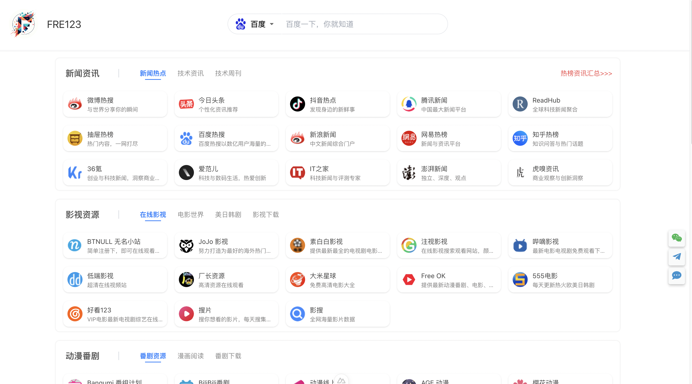

<<<<<<< HEAD
<p align="center">
  
</p>
<h1 align="center">Fre123 Nav</h1>

> 👀 聚合全网热榜、技术资讯&文章&周刊等信息流，为用户提供一站式的信息获取平台，快速了解行业动态。

<!-- 简体中文 | [English](./README_EN.md) -->

在线体验：
- FRE123：[https://www.fre123.com](https://www.fre123.com)

## 特性


项目特点：

- 简洁易用：界面简洁易用，支持一键部署
- 拓展方便：导航数据完全由用户自定义控制

## 部署 
本项目使用 `node v18.16.0` 版本环境 `yarn`作为包管理工具
```
git clone https://github.com/fre123-com/fre123-nav.git

# 安装依赖
cd fre123-nav
yarn install

# 数据配置，具体见下方，配置成功后启动服务
# 启动成功，访问 http://localhost:3000 
yarn dev
```

#### 配置说明
> 本项目数据主要依赖于两部分配置，分别为网站基础配置和导航数据配置。配置文件置于 `store` 目录下,分别对应 `config.json` 和 `nav.json` 文件

##### `config.json` 

| 配置项 | 类型 | 说明 | 默认值 | 参数示例 |
| --- | --- | --- | --- | --- |
| base | object | 网站基础配置 | 无 |  |
| base.app_name | string | 网站名称 | 无 | fre123 |
| base.web_host | string | 网站地址 | 无 | https://www.fre123.com|
| base.logo | string | 网站LOGO | 无 | https://img.fre123.com/i/2023/11/25/65619e8022505.png|
| seo | object | 网站seo相关信息 | 无 | https://www.fre123.com|
| seo.title | string | seo 标题 | 无 | https://www.fre123.com|
| seo.description | string | seo 描述 | 无 | https://www.fre123.com|
| seo.keywords | string | seo 关键词 | 无 | https://www.fre123.com|
| seo.icon | string | 网站地址 | seo 图标 | https://www.fre123.com|
| search.is_show | bool | 是否展示搜索模块 | 无 | https://www.fre123.com|
| search.list | string | 搜索引擎配置，详见下方 `search.list` | 无 | |
| pendant.is_show | bool | 是否展示右侧挂件 | 无 | 是|
| pendant.list | string | 右侧配置，详见下方 `pendant.list`  | 无 | |
| footer.right.is_show | bool | 是否展示底部右侧配置 | 无 | |
| footer.right.list | string | 底部右侧配置，详见下方 `footer.right.list` | 无 | |

###### `search.list`
| 配置项 | 类型 | 说明 | 默认值 | 参数示例 |
| --- | --- | --- | --- | --- |
| name | string | 名称 | 无 | 百度|
| url | string | 搜索引擎跳转地址 | 无 | https://www.baidu.com/s?wd=|
| icon | string | 图标 | 无 | https://img.fre123.com/i/2023/11/26/656303de24efc.png|
| placeholder | string | 输入框提示信息 | 无 | 百度一下，你就知道|

###### `pendant.list`
| 配置项 | 类型 | 说明 | 默认值 | 参数示例 |
| --- | --- | --- | --- | --- |
| icon_class | string | [fontawesome](https://fontawesome.com/v4/icons/) 图标地址 | 无 | fab fa-weixin |
| icon_size | number | 图标大小 | 无 | 20|
| icon_color | string | 图标颜色，可以通过[fre123 取色器](https://www.fre123.com) 进行取色 | 无 | #00b140 |
| icon_hover_color | string | 鼠标移动上去后的展示颜色，可以通过[fre123 取色器](https://www.fre123.com) 进行取色 | 无 | #00b140|
| text | string | 鼠标移动上去后的展示文本 | 无 ||
| img | string | 鼠标移动上去后的展示图标 | 无 | |
| url | string | 跳转地址 | 无 | |


###### `footer.right.list`
| 配置项 | 类型 | 说明 | 默认值 | 参数示例 |
| --- | --- | --- | --- | --- |
| icon_class | string | [fontawesome](https://fontawesome.com/v4/icons/) 图标地址 | 无 | fab fa-weixin |
| icon_size | number | 图标大小 | 无 | 20|
| url | string | 跳转地址 | 无 | |

##### `nav.json` 

| 配置项 | 类型 | 说明 | 默认值 | 参数示例 |
| --- | --- | --- | --- | --- |
| group_name | string | 分组名称 | 无 | 如新闻资讯 |
| tab_list | array | 子分类配置 | 无 | fre123 |
| tab_list.tab_name | string | 子分类名称 | 无 | 新闻热点 |
| tab_list.upper_right_corner | string | 右侧广告位 | 无 | fre123 |
| tab_list.upper_right_corner.title | string | 广告名称 | 无 | fre123 |
| tab_list.upper_right_corner.url | string | 广告地址 | 无 | https://www.fre123.com |
| details | array | 导航列表配置，详见下方 `details.item` | 无 | [] |


###### `details.item`

| 配置项 | 类型 | 说明 | 默认值 | 参数示例 |
| --- | --- | --- | --- | --- |
| title | string | 标题 | 无 | FRE123 |
| url | string | 跳转地址 | 无 | https://www.fre123.com |
| icon | string | 图标 | 无 | https://img.fre123.com/i/2023/11/25/65619e8022505.png |
| description | string | 描述 | 无 | FRE123 专注于为您提供各种免费优质资源，包括影视资源、动漫番剧、软件工具等。无论您在寻找哪种资源，我们都将尽力为您提供，为您的学习或工作助力 |
| is_show | bool | 是否展示 | 无 | true |


**推荐一键部署：👇**

[](https://vercel.com/new/clone?repository-url=https://github.com/Damnnnn2023/fre123_nav&project-name=fre123_nav&repository-name=fre123_nav&demo-title=fre123_nav&demo-description=fre123_nav&demo-url=https%3A%2F%2Ffre123.com&demo-image=https%3A%2F%2Fgeminiprochat.com%2Ficon.svg)

## QA

> 为什么要做这个项目？

详情见：[FRE123 启动计划](https://mp.weixin.qq.com/s/6El2AW93K4RiEHhma3vVPg)

> 我要如何申请后端部署密钥

关注公众号[老胡的储物柜](https://cdn.jsdelivr.net/gh/fre123-com/fre123-info-flow@main/.files/wechat.jpeg)，和老胡联系申请密钥即可

> 有资源共享群么？

有的，同上联系老胡后拉你进群，本群都是热爱分享的朋友，只想潜水勿进，谢谢

## 说明

欢迎加入我们的交流群，一起交流学习：

- 关注公众号：[老胡的储物柜](https://cdn.jsdelivr.net/gh/fre123-com/fre123-info-flow@main/.files/wechat.jpeg)
- 回复 `加群` 即可加入我们的交流群

该项目由 `FRE123` 团队维护，如果您在使用该项目时遇到任何问题，请随时提交 `issue` 或联系我们。
=======
## 项目介绍

> 该项目为`Nuxt3`项目开发模板，其他`Nuxt3`项目可基于此开始开发

项目基本信息如下:

- 项目地址：[web_nuxt_tpl](https://gitlab.zfty.work/infrastructure/template/web_nuxt_tpl)
- 维护作者：2023010

## 快速启动

本项目使用 `node v18.16.0` 版本环境 `yarn`作为包管理工具

```
## 克隆项目
git clone ssh://git@gitlab.zfty.work:8022/infrastructure/template/web_nuxt_tpl.git

## 进入项目
cd web_nuxt_tpl

## 安装依赖
yarn install

## 启动项目
yarn dev
```

## 目录说明

```sh
web_nuxt_tpl
├─ .vscode
│  └─ settings.json          # 在本项目下覆盖开发者vscode的一些配置
├─ assets                    # 对tailwind 和 scss 都做一些全局的配置及变量
│  ├─ tailwind.css
│  └─ variables.scss
├─ components                # 项目组件
├─ composables               # 项目hooks函数
│  └─ useToast.ts
├─ layouts                   # 项目基础布局 default-layout
│  └─ default.vue
├─ middleware                # 中间件
│  ├─ amid.ts                # 具名中间件
│  └─ mid.global.ts          # 全局中间件
├─ pages                     # 项目下的所有页面, 一些示例页面可删除
│  ├─ auth.vue
│  ├─ component.vue
│  ├─ scss.vue
│  └─ tailwind.vue
├─ plugins                   # 项目插件 一些钩子函数
│  └─ vueApp.ts              # Vue App钩子
├─ public                    # 项目静态资源存放地址 例如图片等等
│  └─ favicon.ico
├─ server                    # 服务端一些配置
│  ├─ middleware             # 服务端中间件
│  │  └─ mid.ts
│  ├─ plugins                # 服务端插件 钩子函数 nitro
│  │  └─ nitroApp.ts
│  └─ tsconfig.json          # 服务端一些ts配置
├─ stores                    # 项目store位置
│  └─ global.ts              # 全局store
├─ .editorConfig             # 项目文件字符编码的统一配置
├─ .env                      # 环境变量
├─ .eslintrc                 # eslint配置
├─ .gitignore                # git提交忽略文件
├─ .nvmrc                    # node版本
├─ .prettierrc               # prettier格式化文件配置
├─ app.vue                   # 项目入口app.vue
├─ CHANGELOG.md
├─ global.d.ts               # 全局ts声明模块配置
├─ nitro.config.ts           # 配置nitro的跨域转发代理
├─ nuxt.config.ts            # 全局nuxt的配置
├─ package.json
├─ README.md
├─ tsconfig.json             # ts全局配置
└─ yarn.lock
```

>>>>>>> 038e21e19e8a9662afff1de931bad7f89d4792da
